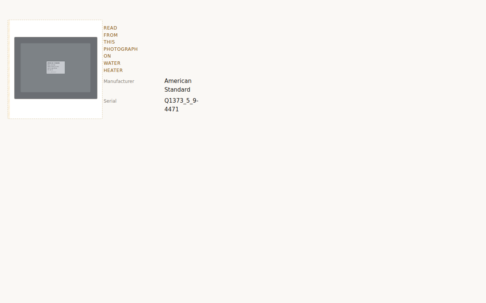

# Note — verification discipline: how to run a check in this repo

**Date:** 2026-07-28
**Written because** five checks against the Checklist Master produced confident wrong
answers in a single session before producing the right one. None reached a report, but
that was diligence, not design — and diligence does not survive being busy.
**Filed here rather than in the schema findings** because it is not a schema fact. It
applies to any check this repo runs against any document, import or fixture.

---

## Why this repo in particular

Most software fails loudly. The checks in this repo fail *plausibly*.

A parse that slices a markdown table one row too far does not crash — it reports eight
extra retired ids, and every one of them looks exactly like a real defect. A regex that
finds zero property flags does not error — it reports that seventeen declared flags are
undeclared, which reads as a serious finding. The output of a broken check and the output
of a real defect are the same shape, and the shape is *alarming*, which is precisely the
state in which a person stops checking and starts acting.

This matters more here than in most codebases because of what the checks are *for*.
CLAUDE.md §4.6 — never drop anything silently — is enforced by exactly this kind of
check. A gap report, an audit run, §1g.2's stale-binding check: each one's job is to tell
a human that something is wrong. **A check that cries wolf degrades the one thing it
exists to provide.**

---

## The five errors, and their single cause

| # | What the check did | What it reported | Why it was wrong |
|---|---|---|---|
| 1 | Regex for `` `property.x` `` in Table A | **0 flags declared** | Table A writes ids bare, without backticks |
| 2 | Line-range window over Table A | 3 flags missing (`finished`, `has_stairs`, `sleeping`) | The window ran into Table B |
| 3 | Table F slice to end of file | **16** retired ids instead of 8 | No lower boundary |
| 4 | Bindings checked against that slice | `pnl.service` is a **broken binding** | It is not retired at all — error 3, one layer downstream |
| 5 | Section 7 slice past `## 8` | Wrong component-type count | No lower boundary |

Errors 1, 3 and 5 are the same error. Error 2 is its mirror — a boundary guessed at
rather than found. Error 4 is the interesting one: **a broken parse that produced a
finding indistinguishable from a real defect, one step removed from the parse itself.**
Nothing about `pnl.service` looked wrong. The number upstream of it did.

**One cause: a boundary assumed rather than located.**

---

## The rules

### 1. Locate every boundary; never assume one

A slice of a structured document has two ends and both must be *found in the document*,
not inferred from what is nearby. `## 8` may not exist. A table may end at a blank line,
a new heading, or the file. Backticks may or may not be there.

In practice: find the start marker, find the end marker, assert both were found, and fail
if either was not. A slice that silently runs to end-of-file is the single most productive
source of false findings in this repo's history.

### 2. A check must name the evidence behind its verdict

Not `pnl.service: broken binding`.
But `pnl.service: absent from the import's snapshot, which declares 409 items`.

The second version is checkable by a reader who knows nothing about the parser. When the
denominator is 409, it is a real defect. When the denominator is 16, or 0, the check is
broken and the reader can see it without reading the code.

This is the rule that turns a wrong answer into an obviously wrong answer. **Every one of
the five was caught this way** — by a number being implausible against something already
known: 17 flags, 8 lineage rows, 409 items, 61 types.

Applies directly to §1g.2 when it is built, at the owner's explicit instruction:

> a broken-binding report produced by a broken parse reads exactly like a real defect.
> When you build that check, make it name the evidence — "this id is absent from the
> import's snapshot, which declares N items" — so an implausible result is visible as
> implausible.

### 3. Establish an independent count before trusting a parse

A check needs an anchor it did not compute itself. 17 Table A flags, 8 Table F rows, 409
live items, 61 typed headings — each was known from the document's own prose or from a
prior round, and each caught a parse that disagreed with it.

Where no independent count exists, produce one *by a different method* before reporting.
Two parses that agree are worth far more than one parse that looks right.

### 4. Never re-derive a boundary the producer already has

*(Added 2026-07-30, after a third and fourth instance.)*

Four now, from one cause:

- **Escaped pipes** in a master table cell — `choice (ball\|gate\|other)`. A naive split
  dropped every such row silently and produced a phantom stale-id report that stood for days.
- **A NUL byte used as a map-key separator**, which collided with the data it separated.
- **A dash inside a composed sentence** — the gap list rendered
  `"Water heater shutoff — water and fuel/power — binding refers to wh.shutoff"`, and the
  screen split it on the dash to group by reason. The **label** contains a dash, so it split
  in half and the item took another item's reason. Splitting on the *last* dash fails too,
  because the reasons contain dashes as well.
- **A section end assumed rather than located**, which miscounted component types by one.

The delimiter framing is too narrow, and rule 1 already covers it. **The sharper form: the
producer knew the parts, composed them into one string, and the consumer tried to
un-compose it.** That is information destruction followed by guessing — and no amount of
care in the guessing recovers what the composition threw away.

**Carry the parts; compose in one place.** It is the same rule as verbatim extraction, which
this repo already ratified for a different reason: normalise at query time, never at write
time, because the write is where the original is lost. A composed sentence is a normalised
value, and re-parsing it is the same mistake wearing different clothes.

The fix is structural rather than careful. `SlotAssessment.missing` carries
`{ what, why? }` and `sentenceOf()` is the one place either becomes prose.

### 5. A fix that removes a symptom has not removed a class

*(Added 2026-07-30.)*

The sentence *"its inputs have not been assessed"* was removed once in Increment 3, when
derived slots gained a fixed-point resolution. It came back in the same increment from a
different direction: a derived slot with no slot-level inputs at all, whose unwired-source
note could not be reached because **§0.5's ordering guarantee ran first.**

**Neither rule was wrong.** The guarantee is correct — a derived slot must return before
any independent emptiness is reachable — and the note is correct. Two correct rules
combined to produce a false sentence, which no test asserted because no test knew to ask.

Only running it showed that. So: after fixing a symptom, ask what *class* it belongs to and
where else that class could surface. And prefer a fix that makes the class unreachable over
one that makes this instance correct.

### 6. Where a missing state would read as a confident answer, add the state

*(Added 2026-07-30.)*

Four instances, all the same shape:

- **typed / stub / undeclared** for a component type — a stub passes a name check and can
  never satisfy a checklist expectation, so two states report it as valid.
- **declared-and-false / never-declared** for a property flag — collapsing them turns every
  vocabulary the builder has not caught up with into a silent *"does not apply"*.
- **verified / unverifiable / unknown-provenance** for a transcribed value — a config
  declaring no capturing item cannot say a value is verified, and two states say it is.
- **superseded / unrecognised** for an answer recorded under a retired item — one says the
  record is malformed, the other says the question moved.

In every case the two-state version reports the unknown case **as the safe one**, which is
exactly backwards: the unknown case is where confident wrongness lives. The third state is
almost never expensive and is almost always where the honesty is.

### 7. A fallback whose input is always present is not a fallback

*(Added 2026-07-31.)*

**It is the only path, and it never announces itself.**

Three instances, and what makes them one rule is that all three produced **fluent,
plausible output that no behavioural test could fail**:

- **`proposed`.** Without the state, an item with a photograph sitting on its pin
  unconfirmed is indistinguishable from an item nobody touched. The report reads *"we did
  not capture this"* about a photograph we are holding — a correct-looking sentence about
  a real item, wrong only in a way you have to already know to look for.
- **The twenty.** Zone scope alone produces the reference export's twenty carried items,
  because the other two scopes happen to be fully answered. A stream two-thirds unbuilt
  passes a total-of-twenty check and stays silent until an export arrives with an
  unanswered component item.
- **The client-facing name.** The composer read each checklist item's `text` as its name,
  with a withholding branch for items that had none. **All 266 items have one**, so the
  branch never ran and the report rendered concierge instructions verbatim — *"Windows
  operated, locked, latched; seal-fog noted — pin defects"*, four of them containing the
  word *issue*, which House Style bans outright.

**The tell is structural, not behavioural, which is why the check is a count.** In each
case there is a branch written for the case where the input is missing, and the input is
never missing — so the branch is dead code that reads as prudence, and the path that
actually runs was never the one anybody reviewed. **Count how often the safe branch
fires.** If it is zero, the safe branch is decoration; if it is everything, the mechanism
is not doing what its name says. Both are invisible until counted.

This is rule 3 pointed at control flow rather than at data: *establish an independent
count before trusting a parse* becomes **establish which branch actually runs before
trusting a design.**

### 8. A scan that fires falsely has still fired — investigate what it caught before narrowing it

*(Added 2026-07-31.)*

**The reflex is to fix the check. The discipline is to read the finding first.**

The instance. A new doctrine scan — *no client-facing string may contain an item id* —
fired on `the ${zone.type}` inside a template literal in the report directory. That is a
property access, not an item id, and the scan was matching the raw source text of an
interpolation. **A false positive, and the obvious response was to narrow the pattern.**

Reading it instead: `zone.type` holds config vocabulary — `living-space`, `utility`,
`bathroom` — and that string was being composed into the location clause of a
**client-facing sentence** for any room nobody had labelled. *"The living-space — was not
covered on this visit."* Config vocabulary in a homeowner's document, which is the exact
failure the scan's section exists to prevent, sitting in already-merged code and reached by
a path no test covered.

The fix was two registers rather than one: a desk display that may name a zone type, and a
client-safe label that carries only what a person actually wrote. **And then the scan
passed on its own terms**, because the offending template no longer lived in the
client-facing directory at all — which is the tell that the finding was real. A narrowed
pattern would have left the defect, the scan, and the false positive all in place.

**Distinct from rule 5**, and worth keeping separate. Rule 5 is *fixing the symptom instead
of the class* — the fix is real but too small. This is *fixing the check instead of reading
the finding* — the fix is aimed at the wrong object entirely, and it destroys the evidence
on its way past.

**The working question is not "is this pattern too broad."** It is **"why did the code look
like the thing I was scanning for."** Sometimes the answer is a coincidence of syntax.
Sometimes the pattern recognised something real that nobody had named yet, which is what a
scan is for.

### 9. A document asserting a checked state must carry the check, not the claim

*(Added 2026-07-31. Ratified by the owner, who supplied two of the three instances.)*

**A sentence that says "checked" is a sentence about the past.** It was true when somebody
ran the check. Everything after that is a claim wearing the clothes of a verified fact, and
the reader cannot tell the difference — which is the whole problem, because the reader is
usually the person who wrote it.

**Three instances this session, all written as intent and read afterwards as fact:**

| Where | Claimed | Actually |
|---|---|---|
| `docs/archive/README.md` | *"No code path, no test, and no live document references anything in this directory"* | **four** live citations pointed at the archived AI Assist Plan by name — `CLAUDE.md` §9, `prompts/README.md`, and two build specs |
| `Note_Verbatim-Extraction` | *"ratified by the owner during Increment 2b"* | recorded, never verified. Corrected in place to the real date |
| the session handoff | *"20 of 41 slots carry a label"* | not 20 |

**The second half of the rule matters as much as the first**, and it is the part that is
easy to get wrong: *carrying a check that itself needs maintaining only moves the problem.*
A hand-written list of the things to check goes stale exactly the way the claim did. **The
check must take its inputs from the artifact it is checking.**

The archive README's fix is the shape. Not a list of filenames to grep for — the filenames
*are* the directory:

```sh
ls docs/archive/HouseSteady_*.md | xargs -n1 basename | sed 's/\.md$//' \
  | xargs -I{} git grep -n {} -- ':!docs/archive'
```

Add a file to the archive and the check covers it without anyone remembering to say so.

#### 9a · The third instance is worse than a wrong number, and that is the lesson

The correction to the handoff was *"which is 19 of 41."* **Counted here, from the schema,
there are three defensible answers and the claim states which reading it uses in none of
them:**

| Reading | Count |
|---|---|
| slots **declaring** `defaultLabel` | **19** |
| slots declaring a **non-null** one | **18** |
| declaring it as **`null`** — `s1.response-procedures` | **1** |

`s1.response-procedures` is a `coverage` slot fed from the template library. Its
`defaultLabel: null` is a **deliberate statement that no honesty label applies** to content
the builder writes — not an omission. So *declared-and-null* and *never-declared* are
different things here, which is the **fifth** time that distinction has decided something
in this repo, after declared-and-false in the trigger evaluator, typed/stub/undeclared for
component types, the verbatim zone-attribute map, and `since`'s four bases.

**So a corrected number is not a carried check.** 20 → 19 fixes the arithmetic and leaves
the shape intact: a bare count, no stated reading, nothing that re-derives it. The rule
wants the reading named and the number produced:

```sh
python3 - <<'EOF'
import json
d = json.load(open("schema/binder-schema-v1.json"))
slots = [s for sec in d["sections"] for s in sec.get("slots", [])]
declared = [s for s in slots if "defaultLabel" in s]
print(f"{len(slots)} slots · {len(declared)} declare defaultLabel · "
      f"{sum(1 for s in declared if s['defaultLabel'] is not None)} declare a non-null one")
EOF
```

Output as of 2026-07-31: `41 slots · 19 declare defaultLabel · 18 declare a non-null one`.
**That line is output, not prose**, and the command above it is why anyone can tell.

#### What it caught immediately

`Slot.defaultLabel` was typed `string | undefined` in `server/src/audit/schema.ts` while the
shipped schema holds a `null`. Nothing reads it yet, so nothing is broken — and the first
thing that does read it would have had `null` narrowed away by the type and would have
treated a deliberate *no label applies* as *nobody said*. Retyped `string | null`, with a
doctrine scan holding it.

**Distinct from rule 2**, which is about a check naming the evidence behind *its own*
verdict. This is about a **document** asserting a state of the world it does not re-derive,
and the failure is slower: rule 2's check is at least still running.

#### 9b · Every new scan is negative-tested when it is written

*(Adopted 2026-07-31.)*

**A scan that has never failed is a claim about a checked state**, which is rule 9 one
level up. So: plant the thing it forbids, confirm it fires, remove the plant. It takes a
minute at the moment of writing, when the offending shape is already in your head.

Two of this session's scans needed it and one of them earned it twice over:

- the archive-citation scan passes on a clean tree, so *passing* proves nothing until you
  have seen it go red. Planted a citation of an archived filename — it fired. Removed it.
- the `defaultLabel` truthiness scan fired on `defaultLabel?: string | null`, **the
  optional-property marker in the declaration it exists to protect.** That is rule 8, and
  it surfaced at write time only because the scan was being exercised rather than merely
  added.

**Not retroactive.** The existing scans are not worth going back through; the cost is real
and the returns fall off sharply once a scan has been reviewed once.

### 10. Read the structure, not a plausible field name

*(Added 2026-08-02, from the first real walk.)*

**A guess that turns out right is indistinguishable from a checked fact, and that
is the problem with it.**

Increment 4 §1f needed the field carrying a recorded `measure` value. The Manifest
Contract does not name it, and **no export had ever contained one** — eleven
measure items declared, none fired. The obvious move was `evidence.value`.

Instead the reader read the *structure*: a lone scalar in `evidence` yields the
value and the key is recorded; several scalars is ambiguity, reported and refused.

The first real walk arrived with two:

```jsonc
"liv.egress-sill"    { "value": "26", "unit": "in" }   // REFUSED — two scalars
"att.access-honesty" { "value": "no access" }          // read, carrier evidence.value
```

**`evidence.value` would have been right.** And the repo would have carried a
lucky guess that nobody could tell from a checked fact — no warning, no record of
having looked, and a `unit` key silently ignored beside it. The refusal named
`unit, value` in a warning, and *that* is how the shape became known.

The rule, in one line: **when a name is unobserved, read the shape and report what
you find.** A structural read that refuses is worth more than a plausible name
that happens to work, because only the first one tells you when it was right.

*(Corollary: `n = 1` stays on the record. One measured value in one export is the
shape seen, not the shape guaranteed.)*

### 11. A check whose distinguishing input is never present has not been passing

*(Added 2026-08-02. Same walk, and the more expensive of the two.)*

The zone-audit oracle compares this repo's reconstruction against the field app's
own exported summary, item for item. It is the safety net under the whole audit
engine, and it **agreed on every run for four increments.**

It was wrong the whole time. The field app folds a pin's component-list items into
the ZONE's summary; the oracle compared its zone-scoped computation against that
folded number.

**It agreed because the reference export has nothing to fold.** Two zones carry a
summary, one typed live pin between them — and that pin's five items are *all
resolved*, so the fold's contribution is exactly zero with or without the bug.
The check was not passing. **It was idle**, and nothing about a green run says
which.

The first real walk had 17 pins across 8 zones. The oracle disagreed on four, every
missing item component-scoped. Folded and re-run: 8 of 8 agree item for item.

**Distinct from rule 9**, which is about a document asserting a state it does not
re-derive. This is a check that *does* run, on data that cannot exercise it. The
question to ask of any green check: **what in this fixture makes a wrong answer
look different from a right one?** If nothing does, the check is a placeholder
with a passing badge.

#### 9c · The CI log was expected to answer this and does not — which is itself the finding

The reasonable hope was that CI history already knows which scans have ever fired, making
retroactive testing unnecessary. **Checked, and it does not.** Every run since the workflow
landed:

| | |
|---|---|
| Runs | **55** |
| Failures | **0** |
| Cancelled (superseded by concurrency) | 1 |

**Green since the first run, so no scan has ever fired in CI.** Not because none of them
work — three fired *this session* — but because every failure was caught and fixed locally
before the push. **CI records the state after fixing, never the fixing**, so its log is a
record of what was true at merge and says nothing about what was ever caught.

That is not an argument for anything elaborate. It is the reason 9b is the only mechanism
actually available: the cheaper alternative was checked, and it is empty. *(One look, not a
project — and the look is done, so nobody needs to repeat it.)*

#### 11a · Idleness moves. A check that was exercised can go idle with nobody touching it

*(Added 2026-08-05, proposed by Builder Code. Rule 11 with the arrow reversed.)*

Rule 11 is written about input that was **never** present. The class frame produced the other
direction and it is the more dangerous one, because nothing announces it.

`class-frame-v1.json` shipped deliberately empty, so `readClassFrame`'s empty-classes branch
and `auditClassFrame`'s empty-run branch were the *exercised* ones and every failure path was
idle — correctly, loudly, with the tests saying so in their names. The content pass landed 32
classes. **Four tests failed and were fixed within the hour. Two live code branches stopped
being reached at the same instant and nothing pointed at them at all.**

> **When a fixture gains content, the branches it stops exercising go silently untested. The
> failing tests get attention because they fail; the departed branch has no such mechanism.**

The asymmetry is the whole point. A check that was never exercised at least has a fixture
somebody can look at and ask rule 11's question of. A check that *stops* being exercised leaves
a green suite, an unchanged test file, and no artefact anywhere recording that the coverage
moved. The only moment it is cheap to notice is the moment the content arrives — which is
exactly the moment attention is on the four red tests instead.

**The practice, and it costs one thought per fixture change:** when a fixture gains content,
list the branches it *used* to reach, and construct the input they have lost. Here that was two
lines — write an empty frame to scratch — and it kept both branches under test rather than
converting a deliberate design decision into dead code by accretion.

**It is rule 5 pointed at coverage.** *A fix that removes a symptom has not removed a class* —
and fixing the tests that went red is a symptom fix when the same event silenced tests that
stayed green.

#### 11b · A check whose two sides cannot disagree has not been passing

*(Added 2026-08-05. Ratified as Increment 5 Amendment 6 §B2, and the worst of the three
because no fixture can fix it.)*

Rule 11 is about a fixture that cannot exercise a check. 11a is about a fixture that stops.
**This one is about a check that was never able to fail, by construction** — where the two
things being compared share an author, a source, or a generator, so agreement is guaranteed
rather than earned.

The repo already knew this shape in one place and did not know it was general. The class
frame's §B3 vocabulary check is documented as weak *because both sides live in one file and
one session wrote them*, and the file states in its own text that the vocabularies must be
authored before the classes — because **a vocabulary harvested from the classes afterwards
makes the check unfailable from birth.**

Amendment 6 is what generalised it. The design session proposed making the class frame
generate the field checklist. It would have been a tidying change, and it would have destroyed
`checkComponentTypes` — §1a is the *strong* cross-check precisely because the class list and
the field config are maintained separately and can disagree. Generated from one another, they
never could. **The only cross-vocabulary check the engine has would have kept reporting green
forever, and the commit that killed it would have read as a simplification.**

> **Before trusting a green comparison, ask what would have to be true for the two sides to
> differ. If the answer is "nothing, given how they are produced", the check is decoration.**

**Why it is the most dangerous of the three.** Rules 11 and 11a describe idleness a better
fixture cures — construct the input, and the check starts working. This kind survives every
fixture, every run and every review, because the defect is in the topology of the data rather
than in the data. **The only moment it is visible is the moment somebody proposes the
unification**, which is exactly when it looks like an improvement.

**The tell is always the same, and it is a question about provenance, not about code:** two
values agree — were they *derived from* each other? Same author, same file, same generator,
same import. Where the answer is yes, the agreement carries no information.

### 12. The name of an act is part of what it claims

**Proposed by the design session 2026-08-03, after the second instance in a fortnight.**

For every act a person can take, ask **what a reasonable reader would believe that person
had verified — and whether they could have.** Where they could not, the act needs a
different name.

**Two instances, both caught by reading doctrine and asking what a word claims. Neither
would ever have failed a test.**

| The act | What its name claimed | What the person could actually check |
|---|---|---|
| `confirmed` covering a generated care interval | a human verified *descale every 12 months* | nothing on screen says so — it is research output |
| `capture-complete` on a zone | a human assessed the capture as sufficient | completeness is not theirs to assess |

**The fix in both cases was a rename, not a restructure.** `adopted` alongside `confirmed`;
`capture-none` instead of `capture-complete`. The workflow did not change — one click per
object, one declaration per empty zone. Only the word did, and with it what the record
claims happened.

**Distinct from rule 9**, which is about documents asserting checked states. This is about
the vocabulary of the acts themselves.

#### 12a · The correction — it was never unscannable

**This rule was first written saying the failure arrives through a button label "where
nothing can scan it". That is wrong, and the correction matters more than the original
sentence.** The words in a user interface are string literals in components. A scan over
user-visible strings is straightforward, and one already existed — *the button label is the
claim*, forbidding a rendered `verify`, `approve` or `certify`.

**What made the class unscannable was not its nature. It was that the scanner could not see
the files.** `sourceFiles()` matched `.ts` only; `web/src` holds one `.ts` file and thirteen
`.tsx`. The scan had been reading `api.ts` and no component at all, reporting green every
run without ever seeing a button.

So the second half of this rule is about the scan rather than the act:

> **The scan for a rule-12 violation is a scan over user-visible strings — and that is the
> scan most likely to be idle, because it looks like a lint rather than a doctrine guard,
> and nobody asks whether a lint is reading anything.**

Rule 11 and rule 12 meet here. The guard against a dishonest word had itself never run, and
its subject was the one thing it could not see.

#### 12b · The worked example



The assist card as it stood: a nameplate rendered at 1200px from a 4032px original, beside
the model's reading of it. **The plate cannot be read. `Q1373_5_9-4471` can.**

CLAUDE.md §9's first guard says *evidence first, suggestion second — physically, in the
layout*, because a confident string beside a thumbnail changes the human's task from *what
does this say* to *does that look right*. The frame above is that sentence as a picture:
the only legible thing on the screen is the thing the concierge is supposed to be checking.
**A photograph the concierge cannot read is not evidence, and a signature over it claims a
verification that could not have happened** — which is rule 12 arriving through a CSS width
rather than through a word.

Fixed by a magnifier, Increment 5 §6.

**Why it needs to be a rule rather than good taste.** Both instances were introduced by
someone applying the doctrine carefully and getting the workflow right. The error was never
in the mechanism — it was in the noun, and the noun is the part nobody re-reads. CLAUDE.md
§6 already fixes what a signature means: *"I observed this, and this description matches
what I saw."* Rule 12 is only the instruction to hold each act's name against that sentence
before shipping it.

---

### 13. A fix for a class of wording is tested on the class, and the test is one grep

**Proposed by the design session 2026-08-04, owner Builder Code. Three instances across two
repos, and the third was named by Field Code against itself.**

When a document turns out to assert something false, the instinct is to fix the sentence.
**The sentence is rarely alone.** A claim that survived long enough to be worth correcting
survived because it was plausible — and a plausible claim gets written down more than once,
by more than one author, in documents that do not cite each other.

> **Having fixed a wording error, grep for the class of it across every document that could
> carry it — including the other repo — before calling it fixed. The sweep is one command.
> Not doing it means the correction lands in the copy you happened to be reading.**

**The three instances:**

| # | The claim | Where it turned out to live |
|---|---|---|
| 1 | *"Pin-scoped resolutions are not counted in the zone summary. The two scopes are independent."* | `Increment-3_Note_Zone-Audit-Reconstruction`. The correction lived in `zoneAudit.ts`'s module note and **nowhere in `/docs`.** An oracle built on it agreed for four increments while wrong |
| 2 | *"Pin number is the cross-visit join key."* | `PLAN-STAGE-1` §7b **and** the binder's carried Manifest Contract v3 copy — one false sentence in two repos. The answer sat in the Observed Addendum's header note while §8 Q4 still read as open. F-29 |
| 3 | A ratified-model contradiction in `REDESIGN-v2` Decision 5 | **Found by Field Code sweeping rather than fixing.** Nine instances, not one — and `CLAUDE.md` names that document *read first*, so it was the highest-traffic copy of the wrong thing and on nobody's list |
| 4 | *"keeps the worked example out of the data"* over a body asserting `theArray === []` | **The first instance in code rather than prose, 2026-08-05.** Two test bodies, `class-frame` and the wording file, both named for a collision guard and neither checking one — they checked emptiness, a different fact that was true while all three schema files shipped empty. The class frame gained content and the assertion failed *for the wrong reason*: not an example leaking, just content arriving. Fixed as one scan over every schema file carrying an example, which is also the guard the two files that are still empty now have before their content lands |

**Why one grep rather than judgement.** Every one of the three was found by somebody reading a
document for an unrelated reason. None was found by care, and none would have been found by
being more careful next time — **the failure is that a correction is scoped to the document
in front of you, and the fix is to make the scope a command rather than an intention.**

**It is rule 5 at the level of prose.** *A fix that removes a symptom has not removed a
class* — and a corrected sentence is a symptom when the same sentence is three files away.
It is also rule 9 turned around: rule 9 says a document asserting a checked state must carry
the check; **this says the check has to run over every document that makes the assertion, not
the one that prompted it.**

**The cheap version, and it is genuinely cheap.** Pick the distinctive four or five words —
*"cross-visit join key"*, *"not counted in the zone summary"* — and grep both repos. Where a
hit is correct in context, say so in the sweep result rather than skipping it silently: two of
Field Code's nine were correct, and recording that is what makes the sweep re-runnable by
somebody else.

---

### 14. A correction is authored whole, never appended

**Named by the design session 2026-08-05 against its own work, owner Builder Code. Third
instance, and the first two are in this repo already.**

Rule 13 says the sweep is one grep. This is the shape of the fix the sweep finds, and it is
the step people skip because appending feels like the honest, additive thing to do.

**Appending a correction to a note leaves the superseded claim in front.** A reader meets
the disproved sentence first and the correction second — if they read that far. The record
is complete and the document still misleads, which is the worst combination available:
nothing was hidden, and the wrong thing is what gets read.

> **Rewrite the whole note so the correction leads, and quote the disproved claim inside it
> rather than leaving it standing as a sentence in its own right. The whole-file rule, one
> level down.**

**The three instances:**

- **The Zone-Audit note** — the original shape.
- **F-29 §7b** — the same, in the field repo.
- **`washer-top-load` in the class frame** — the design session's own, and the one that
  proves the rule is not about carelessness. That note was *added deliberately*, as an
  honest record of a correction, by an author who had just learned the lesson elsewhere.

**Why it recurs even among people who know it.** Appending is what a careful person does:
it preserves the history, it shows the working, it refuses to pretend the error never
happened. Every one of those instincts is right. **The failure is entirely in the ordering**
— and ordering is invisible to the author, who knows the correction is there because they
just wrote it.

**The tell, and it is cheap to run:** read only the first sentence of the note. If that
sentence alone is now false, the note is wrong no matter what follows it.

**What it does not license.** Authored whole never means the superseded claim disappears —
deleting it loses the thing the correction is evidence *of*, and `washer-top-load` is worth
more with its wrong reason quoted than without it. **Lead with the correction, carry the
error inside it.**

## Consequences already in the code

**Nothing in the builder parses the Checklist Master at runtime.** It is read-only
reference in `/docs/reference/`, and a doctrine scan asserts that nothing under
`server/src` or `web/src` references it. The runtime path reads `triggerVocabulary`, which
is structured, has one declaration site, and has no boundaries to locate. Every one of
these five errors is impossible against structured data.

**Per-import snapshots, never a hardcoded list.** CLAUDE.md §5 already requires this for
`naReasons`; the same reasoning covers component types and trigger vocabulary. A parse of
a document can be wrong about what exists; an import's own config snapshot cannot.

**Fail open on vocabulary — with three branches, not two.** A component type is *typed*,
*stub* (declared, ids reserved, no items) or *undeclared*. A stub silently passing as
"declared" looks resolved and is not. Recorded in the fourth addendum to the load-check
findings.

---

## The uncomfortable part

I found all five myself, and reported none of them. That is the good outcome and it is
also the fragile one: it depended on noticing that a number felt wrong, which is not a
process. Rules 1–3 exist to make the same catch without depending on the noticing.

The same discipline appears elsewhere in this repo under different names, which is some
evidence it is the right one:

- **the golden set refuses to let a model judge a model** — a judgement needs an
  independent anchor;
- **unratified expectations gate nothing** — a check whose ground truth nobody has
  confirmed does not get to fail a build;
- **abstention is success** — a wrong answer costs more than no answer, because the blank
  gets chased and the wrong one gets believed.

Rule 2 is the same sentence a third time. A check that names its evidence is abstaining
from the part it cannot support.
